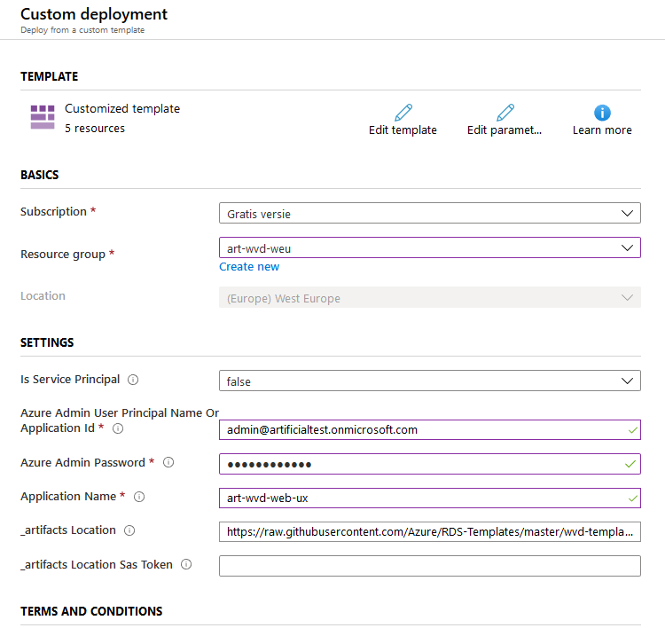
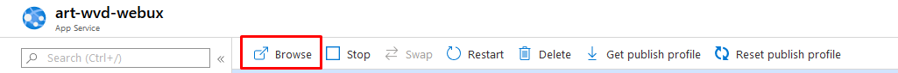
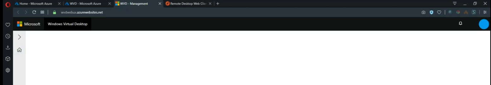
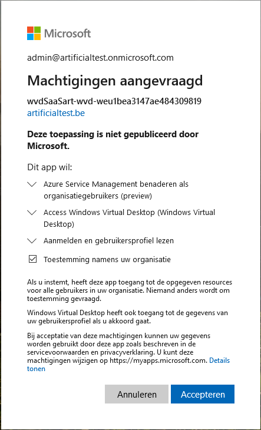
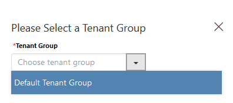
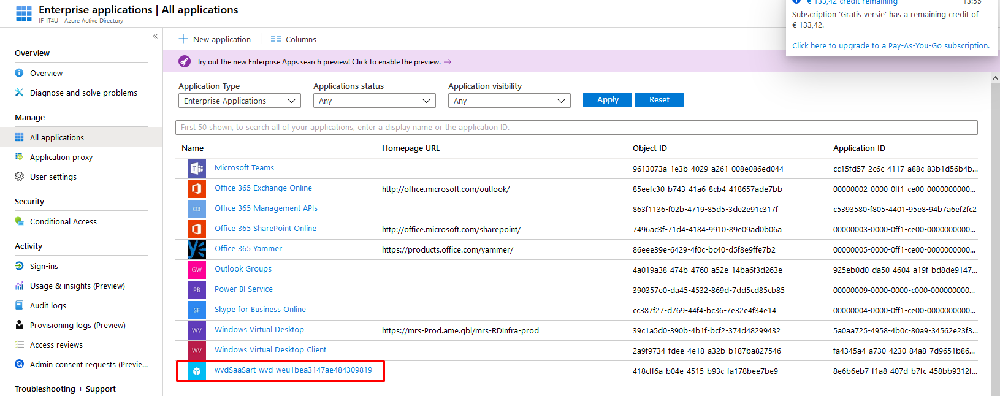
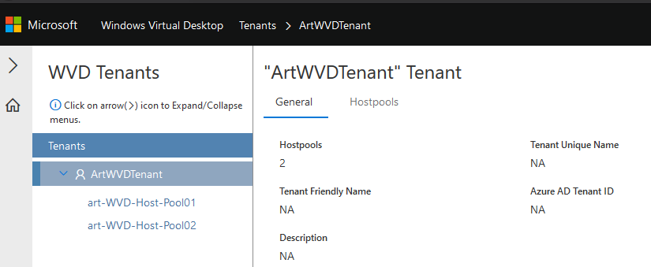
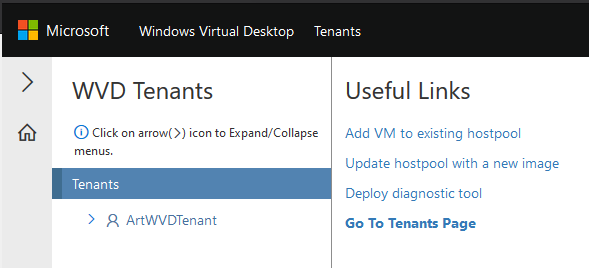
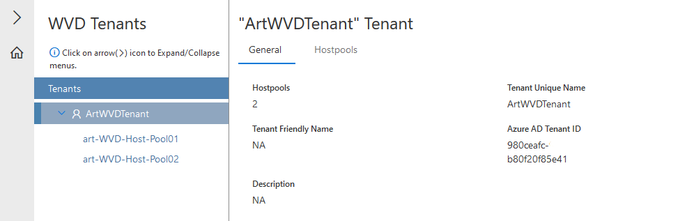

# Windows Virtual Desktop Management en Diagnostics

## Inhoudsopgave
1. [Prerequisites](#Prerequisites)
1. [Diagnostics](#Diagnostics)
2. [Management](#Management)
10. [Bijlagen](#Bijlagen)
11. [Bronnen](#Bronnen)

## Prerequisites

Uiteraard is er een operationele Windows Virtual Desktop omgeving nodig. In het [vorige deel van deze guide](WVD-SetupGuide.md) werd een werkende omgeving opgesteld. 

Naast een werkende omgeving zijn er nog enkele vereisten:
- Eigenaar van een geldige Azure subscription
- Azure Subscription ID
- Permissies om resources aan te maken in Azure
- Permissies om Azure AD apps te maken in Azure
- RDS Owner- of Contributor rechten
- [Azure PowerShell module](https://docs.microsoft.com/en-us/powershell/azure/install-az-ps?view=azps-3.6.1&viewFallbackFrom=azps-2.4.0%2F)
- [Azure AD Module](https://docs.microsoft.com/en-us/powershell/azure/active-directory/install-adv2?view=azureadps-2.0&viewFallbackFrom=azureadps-2.0%2F)

## Diagnostics

### Diagnostics in PowerShell

PowerShell is één van de snelste en meest efficiente manieren om de diagnostiek van opgestelde Windows Virtual Desktop omgeving op te roepen. Het biedt een snel en accuraat overzicht van alle activiteiten, zonder einige extra configuratie of opstelling. Echter vergt het enige kennis van PowerShell en is het niet de meest gebruiksvriendelijke manier om de activiteiten te monitoren. 

De diagnostiek kan bekeken worden aan de hand van één commando. De parameters van dit commando kan gevonden worden in [Microsoft's documentatie van dit commando](https://docs.microsoft.com/en-us/powershell/module/windowsvirtualdesktop/Get-RdsDiagnosticActivities?view=windows-virtual-desktop-1.0.0-preview)

Om de basis diagnostiek en activiteiten te raadplegen kan er gebruik gemaakt worden van het `Get-RdsDiagnosticActivities -TenantName "ArtWVDTenant"` commando. Dit geeft een overzicht van alle activiteiten.

Met onderstaand scriptje worden de meeste activiteiten opgevraagt. Dit script is in zijn geheel terug te vinden in de bijlagen en in het mapje [Scripts](Scripts/DiagnosticsScript.ps1)

```
# Tenant name
$TenantName =  'ArtWVDTenant'

# Start date in MM/dd/YYYY
$StartTime = "03/10/2020"

# End date in MM/dd/YYYY
$EndTime = "03/12/2020"

# Activity ID
 $ActivityId = "6e8c9b79-0a63-40e1-bef4-9244e5fa0100"

# Check activity table
# -----------------------------------------------------------------

Get-RdsDiagnosticActivities `
    -TenantName $TenantName `
    -StartTime $StartTime `
    -EndTime $EndTime `
    | Sort-Object -Property ActivityType, UserName `
    |ft -AutoSize

# Check diagnostics for particular activityID
# -----------------------------------------------------------------
Get-RdsDiagnosticActivities `
    -TenantName $TenantName `
    -ActivityId $ActivityId
```

### Azure Diagnostics Tool for Windows Virtual Desktop


## Management

Het volledige management van de WVD omgeving met betreffende hostpools kan volledig beheerd worden via een elevated PowerShell sessie. Dit biedt een systeembeheerder de mogelijkheid om via de CLI de volledige omgeving te beheren. De volledige PowerShell commando's kunnen [hier](https://docs.microsoft.com/en-us/powershell/module/windowsvirtualdesktop/) terug gevonden worden. 

Powershell is een heel krachtige tool, maar echter niet de meest eenvoudige en gebruiksvriendelijke omgeving. Om het beheer van de WVD omgeving te vereenvoudigen kan er gebruik gemaakt worden van Azure Resource Management tool voor Windows Virtual Desktop. 

### Management tool

De WVD Management tool is een handige en gebruiksvriendelijke web-based management app. Deze tool maakt het beheren van grote WVD omgevingen gemakkelijk, en biedt de mogelijkheid om WVD omgevingen te beheren die opgesteld zijn in verschillende regio's. 

Installatie van deze managementool is eerder eenvoudig. Er wordt gebruik gemaakt van Azure's officiële RDS templates. De templates kunnen gevonden worden in [deze github repository](https://github.com/Azure/RDS-Templates/tree/master/wvd-templates/wvd-management-ux/deploy). 

*Opgelet: De management tool werkt niet als Azure multi-factor authentication is ingeschakeld.*

Klik op onderstaande Deploy to Azure knop om het template te gebruiken.

[](https://portal.azure.com/#create/Microsoft.Template/uri/https%3A%2F%2Fraw.githubusercontent.com%2FAzure%2FRDS-Templates%2Fmaster%2Fwvd-templates%2Fwvd-management-ux%2Fdeploy%2FmainTemplate.json)

Vul het template naar keuze in. Kies een gepaste `Resource group`. In deze demo wordt alles in de zelfde resource groep gestoken. Dit is een persoonlijke keuze.
Let er op dat de `Azure Admin User` RDS-Owner of Contributor rechten heeft en ingevuld is met UPN notatie. Kies tevens een gepaste naam voor de management applicatie. Klik vervolgens onderaan op `Purchase`.



Eens de deployment succesvol is, klik op `go to resource` of navigeer naar `resource group > naam van app`. Klik vervolgens op `Browse`



De management web-app wordt geopend. Momenteel ziet men enkel een wit/leeg scherm. Na een bepaalde tijd wordt er automatisch een inlog prompt getoont. Indien dit niet tevoorschijn komt probeer de pagina te refreshen of op het huisje te klikken. 



Eens er ingelogd wordt met de admin account die men ingesteld heeft voor de management tool hierboven wordt er machtiging van de gebruiker gevraagd.  



Na de machtiging wordt de management tool zichtbaar. Op het linkerdeel van het scherm wordt er gevraagd naar de `tenant group`. Selecteer de juiste tenant group (hoogstwaarschijnlijk `Default tenant group`) en klik op save. Het volledige management luik kan nu behandeld worden in deze tool.



Onder `Enterprise Applications` van `Azure AD` komt de management app tevoorschijn.



Het volledige management van de Windows Virtual Desktop omgeving kan nu beheerd worden vanuit deze tool. 



### Configuratie en management

WVD heeft verschillende handige features:
- Edit en verwijder tenants
- Aanmaken, beheren en verwijderen van hostpools
- Genereren van registration key's om gebruikers toe te voegen aan hostpools
- Berichten sturen naar gebruikers
- Afmelden van gebruikers
- Restrictie van nieuwe sessies op een host
- Herstarten van session hosts en multi sessions
- Toevoegen en verwijderen van Application groups
- Bekijk session details
- Aanmaken app groups voor Desktop en Remote app groups
- Beheren van notificaties


Bij het inloggen op de tool krijgt de administrator onderstaand scherm te zien:



Het "Home" scherm biedt enkele handige links aan die de administrator verder kan helpen met het beheren van de Windows virtual desktop omgeving. Op de linkerzijde van het scherm worden de active tenants weergegeven met hun respectievelijke host pools.



## Bijlagen

### Diagnostics in PowerShell Script

```
# =================================================================
#            ARTIFICIALTEST WVD | Diagnostics script
# =================================================================


# *****************************************************************
# *           Variables | Change variables appropriately          *
# *****************************************************************

# Tenant name
$TenantName =  'ArtWVDTenant'

# Start date in MM/dd/YYYY
$StartTime = "03/10/2020"

# End date in MM/dd/YYYY
$EndTime = "03/12/2020"

# Activity ID
 $ActivityId = "6e8c9b79-0a63-40e1-bef4-9244e5fa0100"

# *****************************************************************
# *              Diagnostics script | DO NOT CHANGE               *
# *****************************************************************

# Check activity table
# -----------------------------------------------------------------

Get-RdsDiagnosticActivities `
    -TenantName $TenantName `
    -StartTime $StartTime `
    -EndTime $EndTime `
    | Sort-Object -Property ActivityType, UserName `
    |ft -AutoSize

# Check diagnostics for particular activityID
# -----------------------------------------------------------------
Get-RdsDiagnosticActivities `
    -TenantName $TenantName `
    -ActivityId $ActivityId
```


## Bronnen

- [Microsoft docs - Deploy diagnostics tool](https://docs.microsoft.com/en-us/azure/virtual-desktop/deploy-diagnostics)
- [Microsoft docs - Manage resources using UI](https://docs.microsoft.com/en-us/azure/virtual-desktop/manage-resources-using-ui)
- [Azure RDS templates](https://github.com/Azure/RDS-Templates/tree/master/wvd-templates/wvd-management-ux/deploy)
- [Microsoft docs - WVD PowerShell commands](https://docs.microsoft.com/en-us/powershell/module/windowsvirtualdesktop/)
- [Share local files with Azure VM](http://geekswithblogs.net/hroggero/archive/2015/03/10/copy-files-from-you-local-computer-to-an-azure-vm.aspx)

***
[Bring me up](#Windows-Virtual-Desktop-Management-en-Diagnostics)

##### Geschreven door [Bernard Deploige](https://be.linkedin.com/in/bernard-deploige)