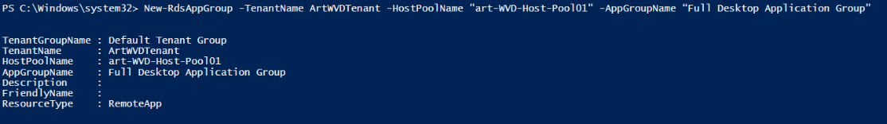
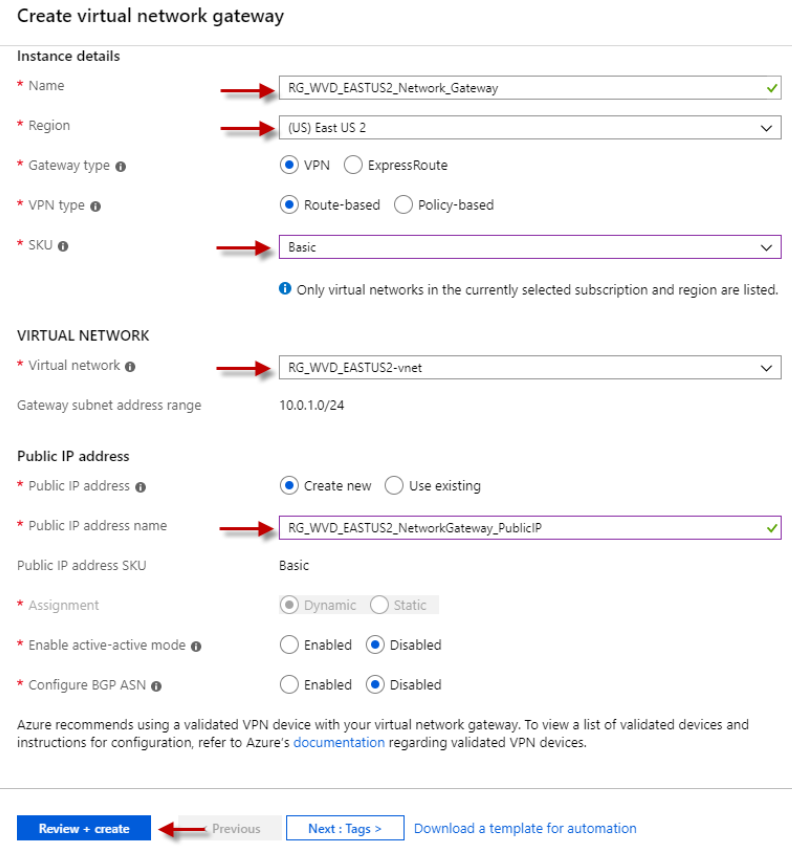

# Windows Virtual Desktop Set-up guide

## Inhoudsopgave

1. [Wat is Windows Virtual Desktop?](#Wat-is-windows-virtual-desktop?)
2. [Prerequisites](#Prerequisites)
3. [Deel 1: Azure registratie en permissies](#Azure-registratie-en-permissies)
4. [Deel 2: Klaarstomen van Windows Virtual Desktop omgeving](#Klaarstomen-van-Windows-Virtual-Desktop-omgeving)
5. [Deel 3: Domein Controller](#Domein-Controller)
6. [Deel 4: Networking](#Networking)
7. [Deel 5: VPN verbinding](#VPN-verbinding)
8. [Deel 6: Promotie tot Domein Controller en Azure AD](#Promotie-tot-Domein-Controller-en-Azure-AD)
9. [Deel 7: WVD VM's](#WVD-VMs)
10. [Bijlagen](#Bijlagen)
11. [Bronnen](#Bronnen)

## Wat is Windows Virtual Desktop

Windows Virtual Desktop (WVD) is een dienst van Azure voor het virtualiseren van applicaties en bureaubladen. In essentie kunnen gebruikers virtuele desktops deployen. In Windows Virtual Desktop kunnen meerdere gebruikers tegelijk gebruik maken van dezelfde Windows machine.

Hiermee lijkt Windows Virtual Desktop zeer sterk op Windows Remote Desktop Services (RDS). Echter wordt het beheer van Windowe Virtual Desktop verzorgt in Azure en krijgt iedere gebruiker een volwaardige Windows 7 of 10 desktop ter beschikking. Bij gevolg zorgt dit er voor dat, in tegenstelling tot Remote Desktop Services, Winows Virtual Desktop wél een goede Office 365 ondersteuning biedt, weinig tot geen profiel issues heeft, als ook Microsoft App Store en Microsoft Edge ondersteund worden. 

### Voordelen

- Virtualisatie van zowel Apps als volledige Desktop
- Virtualisatie van Microsoft 365 in een geoptimaliseerde omgeving
- Beperktere kosten door 'pooling' van multi-session resources
- Volledige ondersteuning van Microsoft 365, Microsoft App Store en Microsoft Edge browser
- Gebruikers hebben één licentie nodig (Microsoft 365 E3/E5 of Windows E3/E5)

## Prerequisites

Voor er van start kan gegaan worden zijn er enkele vereisten die voldaan moeten worden:
- Azure subscription met voldoende credit om de resources te betalen (Een free subscription volstaat om de omgeving op te zetten)
- Toegang tot Azure Active Directory is vereist
- Microsoft Office 365 subscription (E3/E5)
- Office 365 account met Global Administrator rechten
- Azure account met Owner rechten over de Azure subscription
- Windows Virtual Desktop cmdlets voor Windows PowerShell (wordt in deze guide besproken, geen ramp als dit nog niet aanwezig is)

*Opgelet: De deployment van WVD kan in de loop der tijd wijzigen!*

## Azure registratie en permissies

Om gebruik te maken van de Windows Virtual Desktop service is er een Azure account nodig. Log in op [Azure Portal](https://portal.azure.com/) met een account die Global Administrator rechten heeft. Indien u nog geen account heeft kan er één aangemaakt worden. Een nieuwe account krijgt €170 gratis credits. Dit is voldoende om de WVD omgeving op te stellen.

*Opmerking: Voor het aanmaken van een gratis account is een geldig telefoon nummer en credit kaart vereist. Deze worden beide gebruikt voor authenticatie. Er wordt niets aangerekend.*

### Geef Windows Virtual Desktop toegang tot Azure Active Directory

Voor dat er een Windows Virtual Desktop tenant aan gemaakt kan worden moet WVD toegang krijgen tot uw Azure Active Directory. Om deze toegang te verlenen is de Azure AD tenant ID (aka Directory ID) nodig. Deze kan gevonden worden door op Azure Portal te navigeren naar **Azure Active Directory > Properties > Directory ID**.


Navigeer naar de [Windows Virtual Desktop Consent pagina](https://rdweb.wvd.microsoft.com/). Zet de optie **Consent Option:** op `Server App` en vul op de plaats van **AAD Tenant GUID or Name:** de Directory ID in (verkregen in vorige stap). Klik vervolgens op **Submit**. 


Microsoft zal vervolgens vragen of u akkoord gaat met verschillende permissies die nodig zijn voor Windows Virtual Desktop. Het kan zijn dat er nog gevraagd wordt om in te loggen voor de permissies zichtbaar worden. 


Herhaal deze stap ook voor `Client App` als **Consent Option**. Er zal opnieuw gevraagd worden om bepaalde permissies voor Windows Virtual Desktop goed te keuren. Vergeet het **AAD Tenant GUID or Name** veld niet in te vullen met de Directory ID.

### Toewijzing van Administrators en gebruikers

Eens de juiste permissies toegepast zijn op Azure AD moeten de gebruikers permissies onder de loep genomen worden. Er moet minstens één account toestemming hebben om een Windows Virtual Desktop tenant te creëren. Dit is best een gebruiker met Global Administrator permissies. Navigeer naar **Azure Active Directory > Enterprise applications**. Selecteer vervolgens **Windows Virutal Desktop**


***
Navigeer naar **Users and groups** en klik bovenaan op **Add user**. Selecteer vervolgens een gebruiker die toestemming krijg om Windows Virtual Desktop tenants kan creëren. Deze gebruiker is best ook Global Administrator. 


***
Het resultaat zou er ongeveer als volgt moeten uit zien:


## Klaarstomen van Windows Virtual Desktop omgeving

Om de Virtual Machine omgeving op te zetten zijn er twee properties nodig:
1. Azure Directory ID ([Zie vorige stap](#Azure-registratie-en-permissies))
2. Azure Subscription ID

Azure Subscription ID is te vinden onder **Subscriptions**. Gebruik de zoekbalk om hier achter te zoeken. 


### Configuratie met PowerShell

Om de omgeving optimaal te configureren wordt er gebruik gemaakt van PowerShell. 

Eerst en vooral moeten de vereiste PowerShell modules geinstalleerd worden. Deze modules kunnen gedownload worden via [PowerShell Gallery](https://www.powershellgallery.com/packages/Microsoft.RDInfra.RDPowershell/1.0.1804.0) of via PowerShell als Administrator.

Om de module via PowerShell te installeren worden onderstaande commands gebruikt:
```
Import-Module -Name Microsoft.RDInfra.RDPowerShell
Install-Module -Name Microsoft.RDInfra.RDPowerShell
```

Indien er een vorige (outdated) versie van de PowerShell module gebruikt wordt kan deze geüpdate worden met onderstaand commando:
```
Update-Module -Name Microsoft.RDInfra.RDPowerShell
```

Eens de cmdlets geinstalleerd zijn, is het tijd om enkele commando's uit te voeren. Er kan gebruik gemaakt worden van PowerShelle en PowerShellISE. In de ISE versie kunnen commando's/scripts opgeslagen worden. Volgende commando's worden uitgevoerd:
```
Set-executionpolicy -executionpolicy unrestricted
Install-Module -Name Microsoft.RDInfra.RDPowerShell -Force
Import-Module -Name Microsoft.RDInfra.RDPowerShell
Install-Module -Name Az -AllowClobber -Force
Import-Module -Name Az
```

*Opmerkingen:*
- Indien er geprompt wordt bij `Set-executionpolicy` cmdlets, antwoord `yes` of `yes to all`
- Bij `Install-Module` commando's zullen heel wat packages unzipped worden.
- Gebruik altijd een 'elevated PowerShell' sessie voor de commando's in deze guide.

Als laatste stap gebruiken we PowerShell om de Azure acount te linken. Dit gebeurt met onderstaand commando:

```
Add-RdsAccount -DeploymentUrl "https://rdbroker.wvd.microsoft.com"
```
Vul de credentials in van de Tenant creator voor de Windows Virtual Desktop omgeving.


### Windows Virtual Desktop tenant opzetten

Volgende PowerShell commando's worden gebruikt om een Windows Virtual Desktop tenant te creëren. Deze reeks van commando's maken gebruik van de Azure Directory ID en Azure Subscription ID, die in vorige stap reeds verkregen zijn.

Met onderstaand commando wordt een tenant aangemaakt. (voorbeeld commando)
```
New-RdsTenant -Name CompanyWVDtenant -AadTenantId a1b2c3abaa-6f7a-bc3d4-b95c-a1b2c3d4 -AzureSubscriptionId a1b2c3d4-5bef-1234-abcd-a1b2c3abaa
```

Korte uitleg: 
- RDSTenant name is de naam die de tenant zal krijgen
- AadTenantId: Directory ID uit Azure
- AzureSubscriptionId: Subscription ID uit azure

Eens het commando is uitgevoerd is krijgt men een gelijkaardige uitvoer:


*Opmerking: Het bovenstaand commando moet in één lijn uitgevoerd worden. Vergeet de waarde `CompanyWVDTenant` niet te veranderen naar de juiste naam van uw tenant.*

De volgende stap is het aanstellen van RDS Owner. Voor het aanmaken van RDS Owner kan gebruik gemaakt worden van de TenantCreator account (zoals in bovenstaande stappen) of eventueel een andere account (liefst met Global Admin rechten).

Aanstellen van RDS Owner gebeurt aan de hand van onderstaand commando:

```
New-RdsRoleAssignment -RoleDefinitionName "RDS Owner" -UserPrincipalName wvdTenantCreator@yourCompany.upn -TenantGroupName "Default Tenant Group" -TenantName CompanyWVDtenant
```

Eens het commando succesvol is uitgevoerd krijgt men soortgelijke uitvoer:


*Opmerking: -TenantGroupName moet ALTIJD "Default Tenant Group" zijn. Opnieuw moet het commando uitgevoerd worden in één lijn.*

### Host pools en Desktop and Remote Application Groups

Host pools zijn collecties van één of meerder virtuele machines. De machines zijn, in essentie, identiek.

In dit voorbeeld worden twee host pools aangemaakt. Eén voor het deployen van complete bureaubladen, de andere pool zal enkel nodige applicaties pushen. De host pools krijgen respectievelijk de namen `WVD-Host-Pool01` en `WVD-Host-Pool02` en worden vervolgens toegewezen aan `Desktop Application Group` en `Remote Application Group` respectievelijk.

Volgend commando wordt uitgevoerd in PowerShell (Elevated session):

```
New-RdsHostPool -TenantName CompanyWVDtenant -name “WVD-Host-Pool01"
New-RdsHostPool -TenantName CompanyWVDtenant -name “WVD-Host-Pool02"
```

*Opmerking: Commando's zijn twee afzonderlijke lijnen. Vergeet "CompanyWVDTenant" niet aan te passen.*


Vervolgens wordt `Desktop Application Group` aangemaakt op hostpool 1 en `Remote Application Group` op hostpool 2. Gebruik hiervoor onderstaand commando:

```
New-RdsAppGroup -TenantName CompanyWVDtenant -HostPoolName WVD-Host-Pool01 -AppGroupName “Desktop Application Group”
New-RdsAppGroup -TenantName CompanyWVDtenant -HostPoolName WVD-Host-Pool02 -AppGroupName “Remote Application Group”
```

*Opmerking: Commando's zijn twee afzonderlijke lijnen., Vergeet "CompanyWVDTenant" niet aan te passen.*



## Domein Controller

Merk op dat de virtuele machines die aan gemaakt worden "domain-joined" moeten zijn om efficiënt te opereren. Dit wil zeggen dat we een Active Directory Domain Controller nodig hebben. De DC moet geconfigureerd zijn met [Azure AD Connect](https://docs.microsoft.com/en-us/azure/active-directory/hybrid/whatis-azure-ad-connect). Er moet minstens één gebruiker gesynchroniseerd zijn met Azure AD. Met het oog op cyber security is er ook nood aan een Point-to-Site VPN verbinding in Azure. 

Indien bovenstaande prerequisites voldaan zijn kan deze stap overgeslagen worden. 

Er zijn drie mogelijkheden voor het opstellen van een Domein Controller. 

| **Option** | **Pros** | **Cons** |
|-------------|:---:|:---:|
| Use Azure AD DS | Great for test or isolated environments that do not need connectivity to on-premises resources. Azure AD will be your leading source for identities. | AD DS will always be running, resulting in a [fixed charge per month](https://azure.microsoft.com/nl-nl/pricing/details/active-directory-ds/). |
| Spin up a DC in your Azure subscription. | Can sync with on-premises DCs if VPN or ExpressRoute is configured. All familiar AD Group Policies can be used.Virtual machines can be paused or stopped when needed to reduce costs. | Adds additional management of a VM and Active Directory in Azure. |
| Use VPN or ExpressRoute and make sure your on-premises DCs can be found in Azure. | No AD DS or Domain Controller required in Azure. | Latency could be increased adding delays during user authentication to VMs. This assumes you have an on-premises environment, not suitable for cloud only tests. |

**Bron:** [Getting started with WVD](https://techcommunity.microsoft.com/t5/windows-it-pro-blog/getting-started-with-windows-virtual-desktop/ba-p/391054)

In deze guide wordt een Domein Controller aangemaakt in Azure. Zo wordt de gehele opstelling in de Azure cloud beheerd. 

### Creatie van een virtuele machine in Azure

In het Azure Portal gebruiken we het snelmenu links om een Virtual Machine toe te voegen. 

#### Basics
***


In het "Create a virtual machine" scherm worden alle details van de virtuele machine behandeld. Dergelijke configuratie spreekt voor zich. Alle velden met een asterix (*) zijn verplicht. Naast elk veld staat er tevens een (i) icoontje. Onder dit icoon kan informatie over het veld gevonden worden. 

Er zijn enkele velden die extra aandacht vergen:
- `Resource group`: De volledige WVD opstelling moet in de zelfde resource group zitten. Creëer een nieuwe of gebruik een bestaande groep. In deze demo wordt een nieuwe aangemaakt. 
- `Region`: Duidt op de regio waar de VM's aangemaakt worden. De volledige WVD opstelling moet in de zelfde resource group zitten.
- `Image`: In deze demo wordt Windows Server 2019 gebruikt.
- `Size`: Duidt op de server waarom de VM moet draaien. Wij gebruiken `Standard B2s` in deze demo. Voor meer info over de verschillende VM's en hun prijzen kan u bij [Microsoft documentatie](https://docs.microsoft.com/en-us/azure/virtual-machines/windows/sizes) terecht.


Uiteraard is er een lokale Administrator acount nodig op de virtuele machine. Dit kan eender wat zijn. Bij de sectie `Inbound Port Rules` wordt geen enkele poort open gezet. Dit is omdat er in deze demo gebruik wordt gemaakt van een Point-to-Site VPN connectie. Deze wordt later in de demo opgezet. Indien u in een test omgeving werkt kan u gerust poorten naar keuze open zetten.


#### Disk Configuratie
***

Een virtuele machine is zoals een conventionele computer en heeft uiteraard een harde schijf nodig voor opslag. Indien u meer wenst te weten over wat cloud computing juist is en hoe het werkt kan u terecht op [deze link](https://en.wikipedia.org/wiki/Cloud_computing). 

Onder het tab `Disks` vindt u de instellingen voor de verschillende opslag opties. Er wordt in deze demo gekozen voor `Permium SSD`. Dit wordt gekozen omdat de andere opties eerder traag zijn. Klik vervolgens op `Create and attach a new disk` om een nieuwe disk voor opslag te creëren. 


In deze demo omgeving wordt er voor gekozen voor een `Standard HDD` als disk type. Afhankelijk van de omgeving kan dit uiteraard veranderd worden. Alsook kan de grootte van de disk gekozen worden. Merk op dat er enkel betaald wordt voor het deel van de disk die in gebruik is. Stel dat er gekozen wordt voor 1024 GiB en er wordt enkel 200 GiB gebruikt, dan zal er een gebruik van 256 GiB gefactureerd worden. Let er op dat `Host caching` op `None` staat.

*Opgelet! De prijs van virtuele machines is gebaseerd op de gebruikte resources. Hou in het achterhoofd dat de prijs voor opslag, processing en networking componenten hoger wordt naar mate de performantie.*


#### Netwerk configuratie

***

Een belangrijke stap voor het opstellen van een VM, en zeker een DC, is netwerk configuratie. Men moet zorgen voor geldige netwerk instellingen zodat andere VM's het domein kunnen 'joinen'. 

Onder de `networking` tab zal het netwerk geconfigureerd worden. Eerst en vooral wordt er gekozen voor een bestaand virtueel netwerk of het aanmaken van een nieuw netwerk. In deze demo wordt er gekozen voor een nieuw netwerk. Verder wordt er gekozen om geen publiek IP in te stellen aangezien een VPN de verbinding naar de servers zal verzorgen.

*Opmerking: In onderstaande screenshots wordt er gewerkt in een test omgeving. Daarom krijgt de VM een publiek IP-adres en worden publieke poorten open gezet. Dit wordt afgeraden voor operationele omgevingen!*


#### Overige configuratie

***

Verder resteren er nog drie configuratie tabs `Management`, `Advanced` en `Tags`. Onder het management tab wordt de juiste time zone ingesteld. De rest van de opties kunnen naar eigen keuze overlopen worden. Het zelfde geldt voor de opties onder `Advanced` en `Tags`. In deze demo worden alle opties op dergelijke tabbladen op default gelaten. 

Als laatste kan de VM aangemaakt worden. Druk op `Review + Create`. Indien de Review geslaagd is kan de VM aangemaakt worden. Het deployen van een VM als DC kan tot een uur duren. Klik op `Go to resource` eens de VM succesvol deployed is of zoek de VM tussen `Resources`.


## Networking

Zoals vooraf vermeld is networking een zeer belangrijk gegeven in deze opstelling. Zonder een juist opgesteld netwerk kan de domein controller zijn functie niet deftig uitvoeren. Dit zorgt er op zijn beurt voor dat andere VM's het domein niet kunnen joinen.

Navigeer naar `Networking` en klik op `Network Interface`. Ga vervolgens naar `IP configurations`.


Verander `Assignment` van `Dynamic` naar `Static` en klik op `Save` links bovenaan de pagina. Static adressering in Azure zorgt er voor dat het eerste DCHP adres gereserveerd wordt. Het is dus belangrijk dat het IP adres _niet_ gewijzigd wordt naar een ander adres. Eens de configuratie opgeslagen is, klik op de blauwe text `Virtual network/subnet`.


### DNS Server en Subnetting

Uiteraard heeft deze opstelling een DNS Server nodig. Selecteer `DNS servers` onder Settings en kies de `Custom` optie. Vervolgens wordt het  statisch IP adres van de DC VM ingevuld. Daarnaast wordt er een tweede DNS server toegevoegd voor publieke DNS servers. Er wordt in deze opstelling gekozen voor de publieke DNS server van Google, `8.8.8.8`. Dit zorgt er voor dat de DC internet heeft voor het installeren van updates en promotie naar Domein Controller. Vergeet de configuratie niet op te slaan door links bovenaan op het `Save` icoon te klikken.


Navigeer naar het opgestelde virtueel netwerk en kies de optie `Adress Space` onder Settings. Verander `10.0.0.0/24` naar `10.0.0.0/16`.


Kies hierna het de optie `Subnets` en voeg een `Gateway subnet` toe door op de gelijknamige optie te klikken. Verander `Address range (CIDR block)` naar `10.0.1.0/24`


Ter info:
- Virtual network address space: `10.0.0.0/16 (10.0.0.0 – 10.0.255.255)`
- Default subnet: `10.0.0.0/24 (10.0.0.0 – 10.0.0.255)`
- Gateway subnet: `10.0.1.0/24 (10.0.1.0 – 10.0.1.255)`

Met deze stap zit de creatie van de Azure virtuele machine voor de Domein Controller er op. Echter kan deze DC nog niet veilig bereikt worden. Uiteraard is de opgestelde DC nog niet gepromoveerd tot DC.

In de volgende stap wordt de connectie naar DC verzorgd aan de hand van een VPN connectie. Eens er verbinding is zal de DC gepromoveerd worden.

## VPN verbinding

***Opmerking:*** *Deze stap kan overgeslagen worden indien de VM een publiek IP-adres heeft en de RDP, HTTP & HTTPS poorten open staan. Bijvoorbeeld in test omgevingen. Dit wordt echter niet aangeraden.*

Eerst en vooral is het belangrijk dat er een Point-to-Site VPN connectie opgesteld wordt om een connectie te maken naar de VM's zonder de RDP poort te gebruiken. 

In Azure, gebruik de zoekbar om te navigeren naar `virtual network gateways`. Klik vervolgens op "Add" of "Create a virtual network gateway". 


Men krijgt het volgende scherm te zien bij het toevoegen van een virtual network gateway. Onderstaande screenshot geeft een beeld over hoe de configuratie er hoort uit te zien. Klik vervolgens op `Review + create`. Deployment van deze resource kan langer duren dan andere resources. Duurtijd is minstens 30 minuten.

*Opgelet! Zorg er voor dat alle resources in dezelfde regio zitten. In het geval van deze demo is dit Europe-West. Vergeet niet het juiste virtueel netwerk te selecteren. Selecteer het netwerk waar de domein controller in staat.*



### Resources en andere configuraties

Eens de deployment geslaagd is, klik op `go to resource` of navigeer naar "All resources" en selecteer de network gateway die aangemaakt werd in de vorige stap. Selecteer `Point-to-site-configuration` onder Settings. Klik op `Configure now`.


Voor `Address Pool` kan er eender welk private internet range (vb. `172.16.0.0/24`) ingesteld worden. Let wel dat geen enkel toestel in het Azure virtual network een IP heeft in deze range. In deze demo wordt `10.0.0.0/16` gebruikt. Gebruik dus niets dat in deze range ligt. Klik vervolgens op `Save`. 

*Opgelet! Indien deze configuratie faalt, probeer het netwerk adres toe te voegen in Virtual Netwerk, onder Network Space. Zie [deze guide, onder Resources, Certificates, and Other Configurationsesources, Certificates, and Other Configurations](https://securityboulevard.com/2019/11/windows-virtual-desktop-the-best-step-by-step-walkthrough/)*


### Root- en Client certificaten

Voor het aanmaken van Root- en Client certificaten voor Point-to-site-configuratie wordt gebruik gemaakt van PowerShell (Elevated sessie). Deze certificaten worden gebruikt voor encryptie. Gebruik onderstaande scripts voor het aanmaken. Deze scripts maken root- en client certificaten aan voor de P2S connectie onder "Current user > Personal > Certificates"

#### Root certificate

```
#Root cert:
$cert = New-SelfSignedCertificate -Type Custom -KeySpec Signature `
-Subject "CN=P2SRootCert" -KeyExportPolicy Exportable `
-HashAlgorithm sha256 -KeyLength 2048 `
-CertStoreLocation "Cert:\\CurrentUser\\My" -KeyUsageProperty Sign -KeyUsage CertSign
```

#### Client certificate

```
#client cert:
New-SelfSignedCertificate -Type Custom -DnsName P2SChildCert -KeySpec Signature `
-Subject "CN=P2SChildCert" -KeyExportPolicy Exportable `
-HashAlgorithm sha256 -KeyLength 2048 `
-CertStoreLocation "Cert:\\CurrentUser\\My" `
-Signer $cert -TextExtension @("2.5.29.37={text}1.3.6.1.5.5.7.3.2")
```

*Opmerkingen!*
- *Voor meer powerschel commando's voor P2S kan u terecht bij [microsoft documentatie](https://docs.microsoft.com/en-us/azure/vpn-gateway/vpn-gateway-certificates-point-to-site)*
- *Indien er een bestaande firewall bescherming is van de on-prem omgeving kan er een site-to-site VPN connectie opgesteld worden.*

Run het commando `certmgr` in dezelfde PowerShell sessie als hierboven om Certificate Manager te openen. Expandeer `Current User > Personal > Certificates`


Rechterklik op `P2SRootCert` en kies `All Tasks > Export...` en klik twee keer `Next`. Selecteer vervolgens `Base-64 encoded X.509 (.CER)` en klik `Next`.


Bewaar vervolgens het certificaat op een plaats naar keuze. Let er op dat het `.cer` als extentie heeft. Browse naar de locatie van het certificaat en open het met een text editor naar keuze. Kopier de text tussen `----- BEGIN CERTIFICATE -----` en `----- END CERTIFICATE -----`.


In Azure Portal, in de zelf aangemaakte gateway, onder `Point-to-site-configuration > Root certificates` kan het root certificaat toegevoegd worden. Kies een beschrijvende naam en kopiër de key in het `PUBLIC CERTIFICATE DATA` veld. Vergeet niet op te slaan.


### VPN Client

Eens de instellingen opgeslagen zijn, kan de VPN Client gedownload worden. 

Open Certificate Manager door in powershell `certmgr` te runnen. Expandeer `Current user > Personal > Certificates` en rechterklik `P2SChildCert`. Rechterklik en kies `All tasks > Export...`. Klik next. Zorg er deze keer wel voor dat de optie `Yes, export the private key` aangevinkt is! Kies in het volgende scherm `Personal Information Exchange - PKCS #12 (.PFX)` en zorg dat volgende opties aangevinkt zijn:

- [x] Include all certificates in the certification path if possible
- [x] Enable certificate privacy


Vervolgens wordt er gevraagd om een paswoord in te stelen om de private key te beveiligen. Dit paswoord zal gevraagd worden als de VPN client certificate ingesteld wordt voor een nieuwe gebruiker.


Exporteer vervolgens de `.PFX` file naar een locatie naar keuze. Let op de extentie. Optioneel: bovenstaand proces kan herhaald worden voor `P2SRootCert`, zodat er een `.PFX` versie van het certificaat met private key beschikbaar is.

Eens deze stappen doorlopen zijn kan er verbinding gemaakt worden met de domein controller via een VPN verbinding. Open de VPN client die eerder gedownload is. Maak connectie met de VPN. Doe dit door het netwerk icoon onderaan links in de taakbalk aan te klikken. Selecteer VPN connectie.


Indien bovenstaande stappen juist zijn uitgevoerd, is er nu een connectie tot Azure met een Point-to-site VPN verbinding.

## Promotie tot Domein Controller en Azure AD

Maak gebruik van de VPN en RemoteApp en Desktop om vebrinding te maken met de domein controller. Het IP-adres is afhankelijk van het IP van de VM.


Vervolgens kan de domein controller ingesteld worden en gepromoveerd worden tot Domain Controller. Indien u al bekent bent met het configureren van een domein controller kan deze stap over geslagen worden.

Eens ingelogd in de domein controller, open `Computer Management` en selecteer `disk management`. Creëer een nieuwe partitie en kies een letter. (bv. E:). Op deze partitie zullen Logs, databases, Sysvol, enz. bewaard worden.


Voor de configuratie van de Domein Controller werd er in deze demo gebruik gemaakt van [deze guide](https://www.manageengine.com/products/active-directory-audit/kb/how-to/how-to-setup-a-domain-controller.html). Deze guide legt tot in de details uit hoe men een domein controller in stelt en promoveert. 

### Azure AD Connector

Eens de VM succesvol is gepromoveerd naar Domein controller kan Azure AD Connector gedownload worden op de VM. Dit kan via [deze link](https://www.microsoft.com/en-us/download/confirmation.aspx?id=47594). Deze operatie is eerder onconventioneel aangezien AD connector gebruikt wordt om on-prem AD te synchroniseren met Azure AD. Echter zit de on-prem AD al in Azure. Eigenaardig genoeg werkt dit niet zonder deze stap.

Voor de installatie van Azure AD Connector op de DC, wordt er aangeraden om een nieuwe OU in te stellen met enkele gebruiker accounts die men wil synchronizeren met Azure AD. Deze accounts zullen toegewezen worden tot WVD Resources. Creëer een OU genaamd "WVD" en een sub-OU genaamd "WVD Users". De emails van gebruikers moeten overeen komen met UPN van Azure AD Domain.


Vervolgens is het tijd om Azure AD Connector te installeren. 


- Onder het scherm `Install required components` klik `install`
- Onder het scherm `User sign-in` klik `next`
- Onder het scherm `Connect to Azure AD` Log in met Global Admin credentials van Azure en klik `next`
- Onder het scherm `Collect directoris` klik `Add directory`
- Onder het scherm `AD forest account` klik `Use an existing account` en vul Enterprise admin credentials voor betreffende domein in. (in geval van deze demo artificaladmin@artificialorg.onmicrosoft.com) klik vervolgens `next`
- Onder het scherm `Azure AD sign-in` gebruik de dropdown en selecteer `mail` voor On premise attribute. Klik vervolgens op `Continue without matching all UPN suffixes to verify domains` en dan `next`.


- Onder het scherm `Uniquely identifying your users` klik `next` als er één enkel AD directory moet gesynchroniseerd worden. Indien er meerdere zijn, klik `User identities exist across multiple directories`. `Match using: Mail attribute` en klik vervolgens op `next`
- Onder het scherm `Filter users en devices` klik `next` 
- Onder het scherm `Optional features` klik `next` 
- Onder het scherm `Ready to configure` klik `install`
- Onder het scherm `Configuration complete` klik `exit` 

Na enkele minuten zou die synchronisatie compleet moeten zijn. De aangemaakte gebruikers zouden nu zichtbaar moeten zijn in de Azure AD.


## WVD VMs

In het laatste deel van deze guide worden VM's opgesteld voor de Windows Virtual Desktop omgeving. Er zijn drie manieren om dit aan te pakken:
- Gebruik PowerShell
- Gebruik Azure Marketplace en zoek "Windows Virtual Desktop - Provision hostpool"
- Gebruik een Azure Resource Manager Template om VM's aan te maken.

In deze demo wordt gebruik gemaakt van de laatste optie. Dit geeft het beste beeld over hoe een WVD omgeving deployed moet worden. Dit is niet per se de beste optie.

Klik op onderstaande Deploy to Azure knop om het template te gebruiken.

[](https://portal.azure.com/#create/Microsoft.Template/uri/https%3A%2F%2Fraw.githubusercontent.com%2FAzure%2FRDS-Templates%2Fmaster%2Fwvd-templates%2FCreate%20and%20provision%20WVD%20host%20pool%2FmainTemplate.json)

*Opmerking! Bovenstaande knop bevat een link naar een template. Deze template werd gevonden op [deze github repository](https://github.com/Azure/RDS-Templates/tree/master/wvd-templates/Create%20and%20provision%20WVD%20host%20pool). Meer info over het template kan gevonden worden in deze github repository.*

Onder het `Basics` tab van dit template is het belangrijk dat de VM's terecht komen in de resource group die het virtueel netwerk, Point-to-site verbinding en domein controller bezit.

Zorg er namelijk ook voor dat `Location` voor alle resources hetzelfde is.


Uitleg parameters:
- `Rdsh Name Prefix`: Base name van de VM's die opgesteld moeten worden
- `Rdsh Number of Instances`: Aantal VM's die gecreëerd moeten worden (voegt -01, -02, enz. toe aan Base name)
- `Rdsh VM Size`: Type VM (In deze demo `Standard_DS1_v2`)
- `Domain to join`: FQDN van het domein dat gejoined moet worden
- `Existing Domain UPN`: Gebruikersnaam in het domain die 'join' rechten heeft. (UPN formaat)
- `Existing Domain Password`: Paswoord voor bovenstaande gebruiker
- `OU Path`: *Optioneel* - OU pad waar VM's zullen opgeslagen worden
- `Existing VNet Name`: Naam van het eerder opgestelde virtueel netwerk
- `Existing Subnet Name`: Naam van het subnet waar VM's in zullen huizen
- `Virtual Network Resource Group Name`: Naam van de resource group waar het VNet in zit
- `Existing Tenant Name`: Naam van de WVD Tenant
- `Host Pool Name`: Host pool voor VM's. Vb: `WVD-Host-Pool01`
- `Default Desktop Users`: Gebruikers die alvast toegang krijgen tot WVD. Kan later uitgebreid worden. (UPN formaat, moet overeen komen met Azure domain UPN suffix)
- `Tenant Admin UPN or Application ID`: Account met RDS rol (in UPN formaat)
- `Tenant Admin Password`: Wachtwoord bovenstaande gebruiker

Deployment van deze VM's kan enige tijd in beslag nemen. Dit proces kan langer dan één uur duren.

*Opmerking: meer info over prijzen van VM's in Azure kan [hier](https://docs.microsoft.com/en-us/azure/virtual-machines/windows/sizes) gevonden worden.*


Eens de VM's succesvol opgezet zijn kan er verbonden worden met de eerder opgestelde VPN verbinding. Gebruik Remote desktop (`MSTSC.exe`) op de host computer om verbindinding te maken door het private IP-adres te gebruiken. Eens verbonden kan de machine naar keuze geconfigureerd worden (timezone, apps, instellingen, etc.)

Indien u meerdere VM's wil opzetten, bijvoorbeeld één met full desktop en één met enkel Apps, herhaal bovenstaande stappen. Pas onderstaande velden aan:
- `Rdsh Name Prefix`: `wvd-apps`
- `Hostpoolname`: `WVD-Host-Pool02`

### Verificatie VM's

Om de configuratie van Windows virtual desktop omgeving af te werken zal er terug gebruik gemaakt worden van een elevated PowerShell sessie.

Voer onderstaand commando uit en log in op Azure met de Tenant Creator account. Gebruik UPN formaat om in te loggen. (bvb: `user@domain.com`).

```
Add-RdsAccount -DeploymentUrl "https://rdbroker.wvd.microsoft.com"
```

*Opmerking! eens ingelogd kan `Get-RDSTenant` commando gebruikt worden om te verifieren dat de juiste gebruiker verbonden is.*

Vervolgens volgt een verificatie stap die zal nagaan of de VM's verbonden zijn met de correcte pools. Om dit te verifieren kunnen onderstaande commando's gebruikt worden. Let op: Pas `CompanyWVDTenant` en `WVD-Host-Pool` variabelen aan naar de door u gebruikte waarden.

```
Get-RdsSessionHost CompanyWVDtenant WVD-Host-Pool01
```

De output van bovenstaand commando zou gelijkaardig moeten zijn aan onderstaande output. Let vooral op `Status: Available` en `UpdateState: Succeeded`. Dit duidt er op dat de VM verbonden is met de juiste hostpool.


Indien bovenstaande stap faalt kan u terecht in [deze guide](https://securityboulevard.com/2019/11/windows-virtual-desktop-the-best-step-by-step-walkthrough/). In het deel "Verify VM's and Assign Users" is er een uitgebreid troubleshoot plan voorzien.

### Toewijzing gebruikers

Eerder in deze guide werd een host pool aangemaakt (in deze demo `WVD-Host-Pool01`). Vervolgens moeten de gebruikers nog toegewezen worden aan deze hostpool(s). Dit kan uitgevoerd worden door onderstaande commando's. (Gebruik een elevated PowerShell sessie). Vergeer de variabelen niet aan te passen!

*Opgelet: Momenteel hebben enkel gebruikers die bestaan op de domein controller gebruik maken van Windows Virtual Desktop. Gebruikers die enkel leven in Azure AD hebben geen toegang tot de WVD omgeving. Let ook op dat Azure AD sync niet in twee richtingen werkt. De domein controller wordt gesynchroniseerd met Azure AD, maar Azure AD wordt niet gesynchroniseerd met de domein controller.*

```
Add-RdsAppGroupUser -TenantName CompanyWVDtenant -HostPoolName WVD-Host-Pool01 -AppGroupName “Desktop Application Group” -UserPrincipalName username@YourCompany.COM
```

Als laatste stap kan de gebruiker zich abboneren op de WVD Omgeving. Dit kan op twee manieren:
- [WVD Weblient](https://rdweb.wvd.microsoft.com/webclient/index.html)
- [Remote desktop client](http://aka.ms/wvd/clients/windows)

Eens de gebruiker correct is toegevoegd aan de juise host-pool, kan de gebruiker met behulp van Remote desktop verbinding maken met Windows Virual Deskop. De gebruiker krijgt onderstaant scherm te zien en druk op `Abonneren`


Tijdens het abonneren zullen er enkele opties aangeboden worden, deze kunnen door de gebruiker of systeembeheerder naar keuze ingevuld worden. 

*Opgelet! Het kan zijn dat het prompt "Aanvullende beveiligingsverifictie" getoont wordt. Dit scherm vraagt meer informatie over de gebruiker in kwestie. Dit komt omdat de gebruikers niet volledig ingesteld zijn. Dergelijke situatie komt vaak voor in test omgevingen.*


Eens de gebruiker succesvol is aangemeld op de Windows Virtual Desktop omgeving door gebruik te maken van Remote Desktop krijgt men onderstaand scherm te zien. 

*Opmerking: Stel dat een gebruiker is toegevoegd aan een hostpool voor `Full Desktop` en `Remote apps` krijgt hij enkel het icoonje `Session desktop` te zien. Dit komt om dat er nog geen apps zijn toegekent aan de `Remote apps` host pool. Dit wordt behandelt in de volgende stap.*


### Apps publiceren

Bovenstaand probleem wordt opgelost door de publicatie van applicaties. Apps worden toegevoegd aan host pools. Dit wil zeggen dat iedereen in deze hostpool toegang heeft tot de gepubliceerde apps. Gebruik PowerShell(elevated sessie) om een lijst op te vragen van beschikbare apps. 

```
Get-RdsStartMenuApp CompanyWVDtenant WVD-Host-Pool02 “Remote Application Group”
```


Om apps uit de lijst te publiceren wordt er gebruik gemaakt van onderstaand commando. Gebruik bovenstaande lijst om `-Name` en `-AppAlias` te vinden.

```
New-RdsRemoteApp ArtWVDTenant art-WVD-Host-Pool02 “Remote Application Group” -Name "PowerPoint" -AppAlias powerpoint
```


Eens de gewenste apps zijn gepubliceert hebben alle gebruikers van betreffende host pool toegang tot deze applicaties. Indien er apps ontbreken op de Remote desktop feed kan er altijd manueel refreshed worden. 


**Opstellen van WVD omgeving is nu zo goed als compleet. Deze guide zal verder gaan in het managen en beveiligen van de omgeving. Deze guide kan dus nog steeds veranderen!**

## Bijlagen

In onderstaande code blok staan alle gebruikte commando's gebundeld. Opgelet, voer deze code niet in zijn geheel uit. Het is echter *geen* script maar allemaal losse commando's. Deze Windows Virtual Desktop omgeving is (nog) niet geautomatiseerd!

```
# =================================================================
# ArtificialTest WVD | All powershell commands - NOT AUTOMATED!
# =================================================================
#directory id/Azure AD Tenant ID: 980ceafc-98eb-4d06-9f59-b80f20f85e41
#Azure subscription ID: 1bea3147-ae48-4309-8193-e648ae5f0417

# Setting Deployment context
# -----------------------------------------------------------------
$brokerurl = "https://rdbroker.wvd.microsoft.com"

# Azure AD Tenant ID / Directory ID
$aadTenantId = "980ceafc-98eb-4d06-9f59-b80f20f85e41"

# Azure subscription ID
$azureSubscriptionId = "1bea3147-ae48-4309-8193-e648ae5f0417"

Add-RdsAccount -DeploymentUrl $brokerurl

# Create New Tenant
New-RdsTenant -Name ArtWVDTenant -AadTenantId $aadTenantId -AzureSubscriptionId $azureSubscriptionId

# Add new RDS Owner
New-RdsRoleAssignment -RoleDefinitionName "RDS Owner" -UserPrincipalName Admin@artificialtest.onmicrosoft.com -TenantGroupName "Default Tenant Group" -TenantName ArtWVDTenant

# Create host pools
New-RdsHostPool -TenantName ArtWVDTenant -name “art-WVD-Host-Pool01"
New-RdsHostPool -TenantName ArtWVDTenant -name “art-WVD-Host-Pool02"

New-RdsAppGroup -TenantName ArtWVDTenant -HostPoolName "art-WVD-Host-Pool01" -AppGroupName “Full Desktop Application Group”
New-RdsAppGroup -TenantName ArtWVDTenant -HostPoolName "art-WVD-Host-Pool02" -AppGroupName “Remote Application Group”

# Add users when VM is provisioned
# --------------------------------

# Log in with azure credentials
Add-RdsAccount -DeploymentUrl "https://rdbroker.wvd.microsoft.com"

# Verify host pools
Get-RdsSessionHost ArtWVDTenant art-WVD-Host-Pool01
Get-RdsSessionHost ArtWVDTenant art-WVD-Host-Pool02

# Assign users
Add-RdsAppGroupUser -TenantName ArtWVDTenant -HostPoolName art-WVD-Host-Pool01 -AppGroupName “Desktop Application Group” -UserPrincipalName WVDUser1@artificialtest.be
Add-RdsAppGroupUser -TenantName ArtWVDTenant -HostPoolName art-WVD-Host-Pool01 -AppGroupName “Desktop Application Group” -UserPrincipalName WVDUser2@artificialtest.be
Add-RdsAppGroupUser -TenantName ArtWVDTenant -HostPoolName art-WVD-Host-Pool01 -AppGroupName “Desktop Application Group” -UserPrincipalName bernarddeploige@artificialtest.be

Add-RdsAppGroupUser -TenantName ArtWVDTenant -HostPoolName art-WVD-Host-Pool02 -AppGroupName “Remote Application Group” -UserPrincipalName WVDUser1@artificialtest.be
Add-RdsAppGroupUser -TenantName ArtWVDTenant -HostPoolName art-WVD-Host-Pool02 -AppGroupName “Remote Application Group” -UserPrincipalName WVDUser3@artificialtest.be
Add-RdsAppGroupUser -TenantName ArtWVDTenant -HostPoolName art-WVD-Host-Pool02 -AppGroupName “Remote Application Group” -UserPrincipalName bernarddeploige@artificialtest.be

# Remove User from app group (if needed)
Remove-RdsAppGroupUser -TenantName ArtWVDTenant -HostPoolName art-WVD-Host-Pool02 -AppGroupName “Desktop Application Group” -UserPrincipalName WVDUser3@artificialtest.be

# Publish apps for Remote application group
# -----------------------------------------

Get-RdsStartMenuApp ArtWVDTenant art-WVD-Host-Pool02 “Remote Application Group”

# After running the command above, a list of publishable apps will be displayed. Adding apps through PS can be done with following commands:
New-RdsRemoteApp ArtWVDTenant art-WVD-Host-Pool02 “Remote Application Group” -Name "Internet Explorer" -AppAlias internetexplorer
New-RdsRemoteApp ArtWVDTenant art-WVD-Host-Pool02 “Remote Application Group” -Name "Access" -AppAlias access
New-RdsRemoteApp ArtWVDTenant art-WVD-Host-Pool02 “Remote Application Group” -Name "Excel" -AppAlias excel
New-RdsRemoteApp ArtWVDTenant art-WVD-Host-Pool02 “Remote Application Group” -Name "OneDrive" -AppAlias onedrive
New-RdsRemoteApp ArtWVDTenant art-WVD-Host-Pool02 “Remote Application Group” -Name "Outlook" -AppAlias outlook
New-RdsRemoteApp ArtWVDTenant art-WVD-Host-Pool02 “Remote Application Group” -Name "Paint" -AppAlias paint
New-RdsRemoteApp ArtWVDTenant art-WVD-Host-Pool02 “Remote Application Group” -Name "PowerPoint" -AppAlias powerpoint
New-RdsRemoteApp ArtWVDTenant art-WVD-Host-Pool02 “Remote Application Group” -Name "Remote Desktop Connection" -AppAlias remotedesktopconnection
New-RdsRemoteApp ArtWVDTenant art-WVD-Host-Pool02 “Remote Application Group” -Name "Word" -AppAlias word

# Remove published application from the host pool
Remove-RdsRemoteApp -TenantName ArtWVDTenant art-WVD-Host-Pool02 “Remote Application Group” -Name "Internet Explorer"
```

## Bronnen
- [Windows Virtual Desktop Step-by-step](https://securityboulevard.com/2019/11/windows-virtual-desktop-the-best-step-by-step-walkthrough/)
- [Getting started with Windows Virtual Desktop](https://techcommunity.microsoft.com/t5/windows-it-pro-blog/getting-started-with-windows-virtual-desktop/ba-p/391054)
- [6 voordelen van Windows Virtual Desktop](https://www.ingrammicrocloud.com/nl/nl/blogs/de-6-voordelen-van-windows-virtual-desktop/)
- [How to setup a Domain Controller](https://www.manageengine.com/products/active-directory-audit/kb/how-to/how-to-setup-a-domain-controller.html)
- [Azure WVD template Github](https://github.com/Azure/RDS-Templates/tree/master/wvd-templates/Create%20and%20provision%20WVD%20host%20pool)
- [Pricing Azure VM's](https://docs.microsoft.com/en-us/azure/virtual-machines/windows/sizes)
- [Azure Academy - Windows Virtual Desktop video series](https://www.youtube.com/playlist?list=PL-V4YVm6AmwXGvQ46W8mHkpvm6S5IIitK)

***
[Bring me up](#Windows-Virtual-Desktop-Set-up-guide)

##### Geschreven door [Bernard Deploige](https://be.linkedin.com/in/bernard-deploige)
